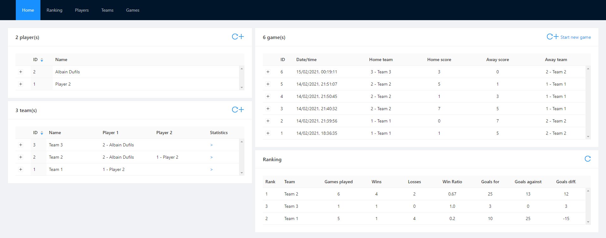
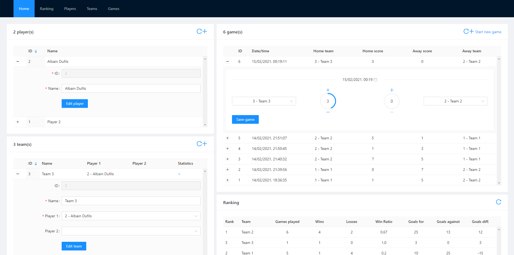

# Table Football Coding Challenge




## Introduction
This web application is used to monitor the internal football table championship.

### Used packages
- React: v17.0.1
- antd: v4.12.2
- axios: v0.21.1

## User stories

- [x] US#1 : As a user, I want to start a new game between two teams so that I can keep track of score as the game is being played.
- [x] US#2 : As a user, I want to create a game that has already been played so that I can enter the result of that game.
- [x] US#3 : As a user, I want to be able to create teams with one or two players so that I can reuse the teams when I create new games.
- [x] US#4 : As a user, I want to see a dashboard with team and individual player statistics so that I can see who is the ultimate champion.

## Improvements

- [ ] Unit test the application
- [ ] Mercure support for live data updates
- [ ] Multiple championship management (ex: 2020, 2021, ...)

## How to run ths project

All the dependencies are available in the `package.json` file.

Before all, you need to install [node.js](https://nodejs.org/en/) and [Yarn](https://classic.yarnpkg.com/en/docs/install/). 

Be aware to run the api first :  [table-football_API](https://github.com/albaindufils/table-football_API)

1) Clone the repository, and install packages : 

```
git clone https://github.com/albaindufils/table-football_UI.git
cd table-football_UI
yarn install 
```

2) Then, run the application : ` yarn start ` 
3) Navigate to [http://localhost:3000](http://localhost:3000)
